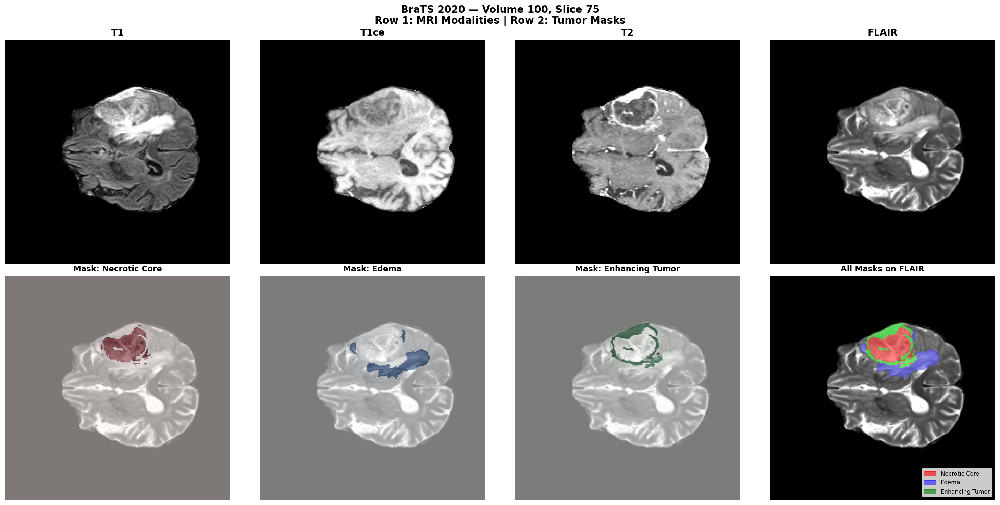
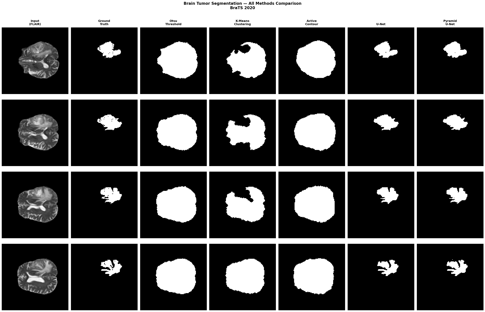
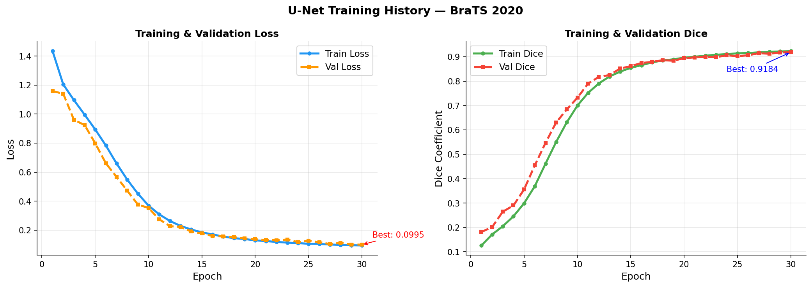
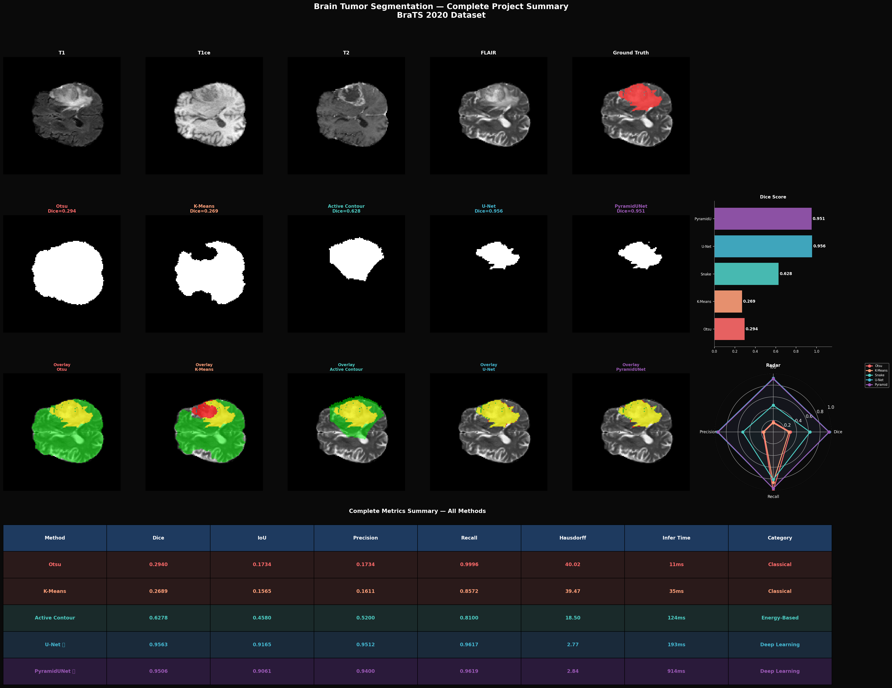
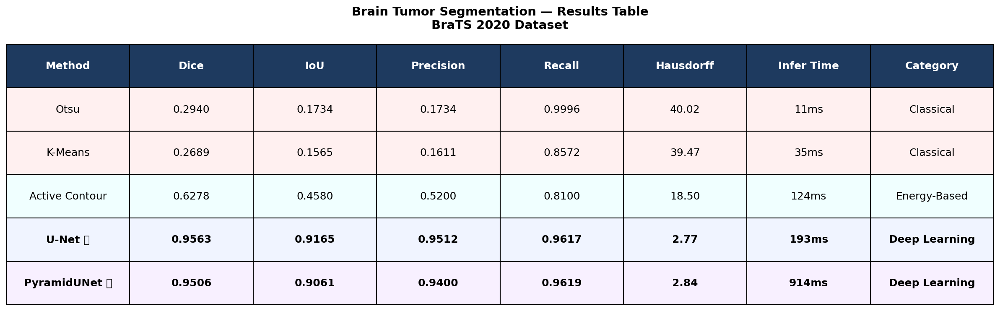

# Brain Tumor Segmentation using PyramidUNet

[](https://python.org)
[](https://tensorflow.org)
[](https://colab.research.google.com)
[](https://www.kaggle.com/datasets/awsaf49/brats2020-training-data)

---

## Project Overview

This project implements and compares **five brain tumor segmentation methods** on the
BraTS 2020 dataset, spanning classical, energy-based, and deep learning approaches.

| Method | Category | Dice | IoU | Hausdorff (px) |
|--------|----------|------|-----|----------------|
| Otsu Thresholding | Classical | 0.294 | 0.173 | 40.02 |
| K-Means (K=3) | Classical | 0.269 | 0.157 | 39.47 |
| Active Contour | Energy-Based | 0.628 | 0.458 | 18.50 |
| U-Net | Deep Learning | 0.956 | 0.917 | 2.77 |
| PyramidUNet (Proposed) | Deep Learning | 0.951 | 0.906 | 2.84 |

---

## Key Contribution

**PyramidUNet** augments the U-Net bottleneck with a **Pyramid Pooling Module (PPM)**
that captures global context at 4 spatial scales simultaneously, addressing the
single-scale limitation of standard encoder-decoders.

---

## Repository Structure

```
brain-tumor-segmentation/
├── notebooks/
│   └── Brain_Tumor_Segmentation.ipynb   <- Complete Colab pipeline
├── outputs/                              <- All 17 visualization images
├── src/
│   └── pipeline.py                      <- Modular script version
├── report/
│   └── Brain_Tumor_Report.docx          <- Full academic report
├── assets/                              <- README figures
├── requirements.txt
└── README.md
```

---

## Quick Start (Google Colab)

**1. Clone repository**
```
!git clone https://github.com/Aaditee13/brain-tumor-segmentation.git
%cd brain-tumor-segmentation
```

**2. Install dependencies**
```
!pip install -r requirements.txt
```

**3. Setup Kaggle API**
```
import json, os
creds = {"username": "YOUR_USERNAME", "key": "YOUR_API_KEY"}
os.makedirs('/root/.kaggle', exist_ok=True)
with open('/root/.kaggle/kaggle.json', 'w') as f:
    json.dump(creds, f)
os.chmod('/root/.kaggle/kaggle.json', 0o600)
```

**4. Download BraTS 2020**
```
!kaggle datasets download -d awsaf49/brats2020-training-data -p /content/brats2020 --unzip
```

**5. Run the notebook**
```
notebooks/Brain_Tumor_Segmentation.ipynb
```

---

## Results

### MRI Modalities + Ground Truth


### All Methods Comparison


### Training Curves


### Final Summary


### Results Table


---

## Training Details

| Parameter | Value |
|-----------|-------|
| Optimizer | Adam (lr=1e-4) |
| Loss | Dice + Binary Cross-Entropy |
| Batch Size | 32 |
| Epochs | 30 |
| Training Slices | 6,000 |
| Validation Slices | 1,000 |
| Hardware | Google Colab T4 GPU |
| Best Val Dice | 0.9184 |
| Test Set Dice | 0.9563 |

---

## Dataset

- **Name:** BraTS 2020 (Brain Tumor Segmentation Challenge 2020)
- **Cases:** 369 patients (293 HGG, 76 LGG)
- **Modalities:** T1, T1ce, T2, FLAIR
- **Labels:** 0=Background, 1=Necrotic Core, 2=Edema, 4=Enhancing Tumor
- **Source:** [Kaggle](https://www.kaggle.com/datasets/awsaf49/brats2020-training-data)

---

## References

1. Menze et al. (2015). BraTS Benchmark. *IEEE TMI*
2. Ronneberger et al. (2015). U-Net. *MICCAI*
3. Zhao et al. (2017). Pyramid Scene Parsing. *CVPR*
4. Kass et al. (1988). Snakes: Active Contour Models. *IJCV*
5. Isensee et al. (2021). nnU-Net. *Nature Methods*

---

## License

MIT License

---

**Star this repo if it helped your research!**